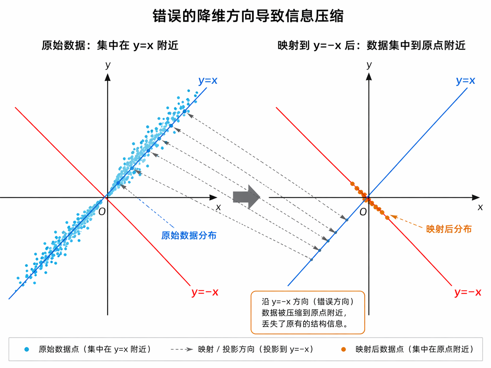
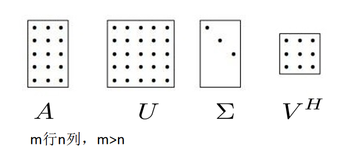
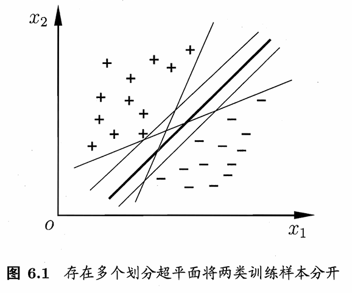
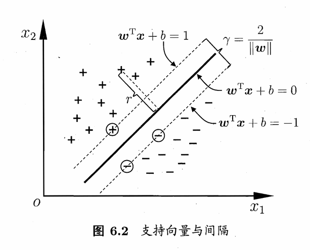
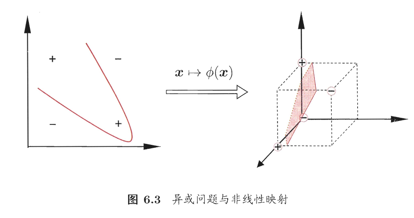
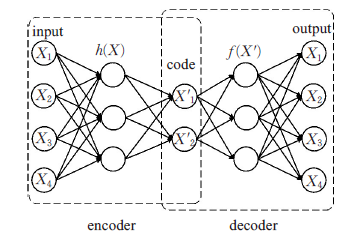

# 主成分分析 (PCA)
主成分分析就是一种降维方法，针对一组 $n$ 维的数据集，我们希望对其进行这样的分析：他可能在 $m$ 维 $(m<n)$ 中聚集 (比如二维空间中的数据集主要集中在直线 $y=x$ 附近，我们希望找到这样的方向) 。这就是我们主成分分析希望做的事儿。

## 基本概念
PCA (Principal Component Analysis) 的主要思想就是将 $n$ 维特征映射到 $k$ 维上，这 $k$ 维是全新的正交特征也被称为主成分，这样的算法在去噪等方向上有十分重要的应用。

## 算法思想
既然我们希望能保留数据的原始特征，我们就希望在降维的时候，数据不会缩成一团 (就像在二维空间中如果数据沿着 $y=x$ 分布，我们不希望将这样的二维数据压缩在 $y=-x$ 这条线上，这样的话所有的数据可能就会集中在原点附近)



从这个角度出发，我们就知道，我们希望我们降维之后的数据分的越开越好，如何描绘分的比较开的数据数理统计已经告诉我们了：方差。我们只要保证压缩后的数据方差最大，我们就可以保证这一点，也就实现了 PCA 算法的核心要求。

## 数学建模
针对 $n$ 个 $d$ 维的数据集 $D=\{\boldsymbol{x}_1,\cdots,\boldsymbol{x}_n\}$ ，我们可以将其写作 $\boldsymbol{X}\in\mathbb{R}^{n\times d}$ , 我们将映射用一个矩阵 $\boldsymbol{W}\in\mathbb{R}^{d\times l},\ l<n$ ，并且我们规定 $\boldsymbol{w}_i^T\boldsymbol{w}_i=1$ ，这样规定的意义在于让数据集按照规定的大小比例进行变换，防止在选择 $\boldsymbol{W}$ 时由于大小变换使得方差变大或者变小，则通过计算


```math
\boldsymbol{Y}=\boldsymbol{XW}
```


则有 $\boldsymbol{Y}\in\mathbb{R}^{n\times l}$ 就是降维后的数据。根据上面的要求我们要使 $Var \boldsymbol{Y}$ 最大。当然 这里为了消除数据 $\boldsymbol{X}$ 均值的影响，我们可以做中心化处理：


```math
\boldsymbol{X}_c=\boldsymbol{X}-\bar{\boldsymbol{x}}
```


后面我们就用 $\boldsymbol{X}$ 代替 $\boldsymbol{X}_c$ 表示中心化过后的数据。

## 特征值分解求解主成分分析问题
利用《数理统计》中的统计量的计算方法，我们可以这样计算 $Y$ 的方差：


```math
Var Y=\dfrac{1}{n-1}tr(\boldsymbol{Y}^T\boldsymbol{Y})=\dfrac{1}{n-1}tr (\boldsymbol{W}^T\boldsymbol{X}^T\boldsymbol{XW})=tr(\boldsymbol{W}^T\dfrac{1}{n-1}\boldsymbol{X}^T\boldsymbol{XW})
```


此时记 $\Sigma=\dfrac{1}{n-1}\boldsymbol{X}^T\boldsymbol{X}$ ，则我们的问题就转化为了


```math
\begin{array}{ll}
    \max\limits_{\boldsymbol{W}}& tr(\boldsymbol{W}^T\boldsymbol{\Sigma}\boldsymbol{W})\\
    s.t. & \boldsymbol{w}_i^T\boldsymbol{w}_i=1,\ i\in\{1,2,\cdots,l\}
\end{array}
```


下面使用拉格朗日乘子法 (Lagrange Multiplier) ，对函数


```math
\mathcal{L}(\boldsymbol{W},\lambda)=tr(\boldsymbol{W}^T\boldsymbol{\Sigma W})-\sum\limits_{i=1}^l\lambda_i(\boldsymbol{w}_i^T\boldsymbol{w}_i-1)
```


其中 $\lambda_i$ 就是拉格朗日乘子，对每个变量 $\boldsymbol{w}_i$ 求偏导，我们得到：


```math
\boldsymbol{\Sigma w}_i=\lambda_i\boldsymbol{w}_i
```


这就说明 $\lambda_i$ 是 $\boldsymbol{\Sigma }$ 的特征值， $\boldsymbol{w}_i$ 是关于 $\lambda_i$ 的特征向量。此时为了让这里的方差最大，我们选取前 $l$ 个特征值及特征向量，这就是我们所想要的 $\boldsymbol{W}$ .


## 最小投影距离角度建模
针对 PCA 问题的数据集 $\{\boldsymbol{x}_1,\cdots,\boldsymbol{x}_n\}$, 其中 $\boldsymbol{x}_i\in\mathbb{R}^d$ , 我们希望将其降到某个 $k$ 维空间中，我们选取某个 $k$ 维空间的一组基向量 $\boldsymbol{U}=\{\boldsymbol{u}_1,\cdots,\boldsymbol{u}_k\}$, 其中 $\boldsymbol{u}_i\in\mathbb{R}^d$ ，这里我们将 $\boldsymbol{x}_i$ 投影到 $\boldsymbol{U}$ 上，得到 $\boldsymbol{v}_i=\boldsymbol{U}^T\boldsymbol{x}_i$ , 我们希望 $\boldsymbol{v}_i$ 和 $\boldsymbol{x}_i$ 之间的距离尽可能小，也就是
```math
\min\limits_{\boldsymbol{U}}\|\boldsymbol{X}-\boldsymbol{U}^T\boldsymbol{V}\|^2_F\quad s.t.\ \boldsymbol{U}^T\boldsymbol{U}=\boldsymbol{I}
```
其中 $\boldsymbol{U}^T\boldsymbol{V}$ 就是从 $\boldsymbol{U}$ 上投影回来的数据，我们希望这个数据和原始数据 $\boldsymbol{X}$ 之间的距离尽可能小，这样就保证了我们降维之后的数据能够尽可能保留原始数据的特征。
利用上面的数量关系我们可以知道 $\boldsymbol{V}=\boldsymbol{X}^T\boldsymbol{U}$ , 代入上面的式子，我们就得到了
```math
\min\limits_{\boldsymbol{U}}\|\boldsymbol{X}-\boldsymbol{U}^T\boldsymbol{U}^T\boldsymbol{X}\|^2_F\quad s.t.\ \boldsymbol{U}^T\boldsymbol{U}=\boldsymbol{I}
```
做进一步化简，并作一步代换，我们最终得到：
```math
\max\limits_{\boldsymbol{U}}tr(\boldsymbol{U}^T\boldsymbol{X}^T\boldsymbol{X}\boldsymbol{U})\quad s.t.\ \boldsymbol{U}^T\boldsymbol{U}=\boldsymbol{I}
```
这就回到了我们之前的特征值分解求解 PCA 的问题了。

## 关于奇异值分解 (SVD)
奇异值分解我们事实上在高代中已经学过了，但显然我们基本全部忘记了，我们来复习一下，他做了这样一件事儿：对矩阵 $\boldsymbol{A}\in\mathbb{R}^{m\times n}, m>n$ ,我们可以得到


```math
\boldsymbol{A}=\boldsymbol{U\Sigma V}^T
```



其中 $\boldsymbol{U}\in\mathbb{R}^{m\times m},\ \boldsymbol{V}\in\mathbb{R}^{n\times n},\ \boldsymbol{\Sigma}$ 中的元素满足 $\sigma_{ij}=0,\ i\neq j$. 其中 $\boldsymbol{\Sigma}$ 对角线上的元素就是奇异值， $\boldsymbol{U},\boldsymbol{V}$ 都是正交阵。

至于特征值分解是如何推导的我们已经不再关注了，有兴趣的同学可以自行了解一下，我们只来讲解一下如何实现特征值分解：
* 计算 $\boldsymbol{U}$ ：其列由 $\boldsymbol{AA}^T$ 的特征向量组成，且特征向量为单位向量
* 计算 $\boldsymbol{\Sigma}$ ：其对角元素的值为 $\boldsymbol{A}^T\boldsymbol{A}$ 的特征值的平方根，并按照降序排序。
* 计算 $\boldsymbol{V}$ ：其列由 $\boldsymbol{A}^T\boldsymbol{A}$ 的特征向量组成，且特征向量为单位向量。

### 经济型 SVD
这种 SVD 我们保证 $\boldsymbol{\Sigma}$ 是一个方阵，结构如下：对矩阵 $\boldsymbol{A}\in\mathbb{R}^{m\times n},\ m>n,\ r=rank(A)$ , 我们可以做这样的奇异值分解：


```math
\boldsymbol{A}=\boldsymbol{U}_r\boldsymbol{\Sigma}_r\boldsymbol{V}_r^T
```


其中 $\boldsymbol{U}_r\in\mathbb{R}^{m\times r},\ \boldsymbol{\Sigma}\in\mathbb{R}^{r\times r},\ \boldsymbol{V}_r\in\mathbb{R}^{n\times r}$ ，这里 $\boldsymbol{U}_r,\boldsymbol{V}_r$ 满足：


```math
\boldsymbol{U}_r^T\boldsymbol{U}_r=\boldsymbol{V}_r^T\boldsymbol{V}=\boldsymbol{I}_r
```


具体计算过程我们可以参考网上的[教程](SVD.md)。

## 奇异值分解 (SVD) 求解主成分分析问题
在前面的内容中我们已经提出我们关心协方差矩阵 $\boldsymbol{C}=\dfrac{1}{n-1}\boldsymbol{X}^T\boldsymbol{X}$ , 此时如果我们对 $\boldsymbol{X}$ 做经济型奇异值分解 $\boldsymbol{X}=\boldsymbol{U\Sigma V}^T$ ，那么可以得到：


```math
\boldsymbol{X}^T\boldsymbol{X}=(\boldsymbol{U\Sigma V}^T)^T(\boldsymbol{U\Sigma V}^T)=\boldsymbol{V\Sigma}^T\boldsymbol{U}^T\boldsymbol{U\Sigma V}^T=\boldsymbol{V\Sigma}^T\boldsymbol{\Sigma V}^T
```


并且 $\boldsymbol{\Sigma}^T\boldsymbol{\Sigma}=\begin{bmatrix}
    \sigma_1^2 & 0 & \cdots & 0\\
    0 & \sigma_2^2 & \cdots & 0\\
    \vdots & \vdots & \ddots & \vdots\\
    0 & 0 & \cdots & \sigma_r^2
\end{bmatrix}$，也就是说 $\boldsymbol{C}=\dfrac{1}{n-1}\boldsymbol{V\Sigma }^2\boldsymbol{V}^T$ ，对两侧右乘 $\boldsymbol{V}$ ，得到


```math
\boldsymbol{Cv}_i=\dfrac{\sigma_i^2}{n-1}\boldsymbol{v}_i
```


那么 $\boldsymbol{C}$ 的第 $i$ 个特征值就满足 $\lambda_i=\dfrac{\sigma_i^2}{n-1}$ .

使用奇异值分解的原因在于我们可以直接作用在原始中心化数据矩阵 $\boldsymbol{X}$ 上，不需要显式构造协方差矩阵，并且当 $d$ 很大时，这里的协方差矩阵将非常大。

## 选择降维后的维度 $K$ 
至于选择的维度 $K$ ，根据 PCA 的原始论文，我们可能有三种可行的方案：
* 用户可能会给出具体需要多少个维度
* 如果我们假设信号中有 $p\times 100\%$ 为噪声，则我们有


```math
\sum\limits_{i=1}^K\lambda_i\geqslant p\sum\limits_{i=1}^d\lambda_i
```


* 我们可以设定一个小于 $1$ 的数 $\varepsilon$ ，如果 $\lambda_i\geqslant \lambda_1$ 则接受他，否则拒绝他。

# 支持向量机 (SVM)
## 间隔与支持向量
对于分类问题，其训练样本为 $D=\{(\boldsymbol{x}_1,y_1),(\boldsymbol{x}_2,y_2),\cdots(\boldsymbol{x}_n,y_n)\},\ y_i\in\{-1,1\}$ , 将其放在坐标系中，我们希望能够找到某个超平面，能够将这些正例和反例分隔开。

在样本空间中，划分超平面用下面的线性方程来描述：


```math
\boldsymbol{w}^T\boldsymbol{x}+b=0
```


其中 $\boldsymbol{w}$ 是法向量， $b$ 是位移项，对任意样本空间中的点 $\boldsymbol{x}$ ，其到超平面 $(\boldsymbol{w},b)$ 的距离为


```math
r_{\boldsymbol{x}}=\dfrac{|\boldsymbol{w}^T\boldsymbol{x}+b|}{\|\boldsymbol{w}\|}
```


假定我们已经找到了划分超平面能够将训练样本正确分类，由于线性方程中 $(\boldsymbol{w},b)$ 可以等比例调整大小，因此我们令：


```math
\left\{\begin{array}{ll}
    \boldsymbol{w}^T\boldsymbol{x}_i+b\geqslant 1, & y_i=1\\
    \boldsymbol{w}^T\boldsymbol{x}_i+b\leqslant -1,& y_i=-1
\end{array}\right.
```


此时我们找到距离超平面最近的几个样本，也就如下图所示，他们被称为支持向量，此时两个异类支持向量到超平面的距离之和为


```math
\gamma=\dfrac{2}{\|\boldsymbol{w}\|}
```


他被称为间隔。

从图中我们不难看出，为了让模型的泛化能力尽可能强，我们就希望间隔尽可能大，也就是实现下面的数学模型：


```math
\begin{array}{ll}
    \max\limits_{\boldsymbol{w},b} & \dfrac{2}{\|\boldsymbol{w}\|}\\[12pt]
    s.t. & y_i(\boldsymbol{w}^T\boldsymbol{x}_i+b)\geqslant 1,\ i=1,2,\cdots,m
\end{array}
```


或者我们将其写作：


```math
\begin{array}{ll}
    \min\limits_{\boldsymbol{w},b} & \dfrac{\|\boldsymbol{w}\|^2}{2}\\[12pt]
    s.t. & y_i(\boldsymbol{w}^T\boldsymbol{x}_i+b)\geqslant 1,\ i=1,2,\cdots,m
\end{array}
```


## 对偶问题
这里本质上就是利用[拉格朗日乘子法](Method_of_Lagrange_Multipliers.md)和 KKT 方法。针对上面的规划问题，我们应用拉格朗日乘子法，计算过程可以参考教材，最终得到下面的二次规划问题：


```math
\begin{align*}
    \max\limits_{\boldsymbol{\alpha}} & \sum\limits_{i=1}^m \alpha_i-\dfrac{1}{2}\sum\limits_{i=1}^m\sum\limits_{j=1}^m\alpha_i\alpha_j y_i y_j\boldsymbol{x}_i^T\boldsymbol{x}_j\\
    s.t. & \sum\limits_{i=1}^m\alpha_iy_i=0\\
    & \alpha_i\geqslant 0,\ i=1,2,\cdots,m
\end{align*}
```


他的 KKT 条件为


```math
\left\{\begin{array}{l}
    \alpha_i\geqslant 0\\[6pt]
    y_if(\boldsymbol{x}_i)-1\geqslant 0\\[6pt]
    \alpha_i(y_if(\boldsymbol{x}_i)-1)=0
\end{array}\right.
```


这个问题可能由于训练样本较大，时间和空间成本较大，因此我们在这里介绍一个 SMO 算法。

SMO 算法本质上就是一个跷跷板游戏，如果我确定两个参数 $\alpha_i,\alpha_j$ ，其他的参数保持不变，此时如果我改变 $\alpha_i$ ，结合


```math
\alpha_k y_k=-\sum\limits_{i\neq k}\alpha_i y_i=C
```


我们知道 $\alpha_j$ 将会随着 $\alpha_i$ 的变化而变化，因此他的执行步骤是这样的:
1) 初始化 $\boldsymbol{\alpha}$ 后计算 

```math
u_i=\boldsymbol{w}^T\boldsymbol{x}_i+b=\sum\limits_{j=1}^m\alpha_jy_j(\boldsymbol{x}_j^T\boldsymbol{x}_i)+b
```


并得到每个样本的误差 $E_i=|y_i-u_i|$ , 找到误差最大的两个方向，确定变动的参数 $\alpha_i, \alpha_j$ .
2) 固定其他参数，并计算 $C=\alpha_iy_i+\alpha_j y_j$ ，并以此用 $\alpha_i$ 表示 $\alpha_j$ ，将问题转化为一元二次函数求极值问题。
3) 对 $\alpha_i,\alpha_j$ 的范围，如果超出范围直接取到范围的上/下界。
4) 不断更新迭代，直至所有 $\alpha_i$ 满足 KKT 条件。

那么最后的问题就是如何确定偏移项 $b$ 。结合所有支持向量 $(\boldsymbol{x}_s,y_s)$ 都满足 $y_sf(\boldsymbol{x}_s)=1$ ，也就是


```math
y_s\bigg(\sum\limits_{i\in S}\alpha_iy_i\boldsymbol{x}_i^T\boldsymbol{x}_s+b\bigg)=1
```


其中 $S=\{i|\alpha_i>0,i=1,2,\cdots,m\}$ ，通过求解它获得 $b$ ，但是现实任务中我们一般采用这样的方法：


```math
b=\dfrac{1}{|S|}\sum\limits_{s\in S}\bigg(y_s-\sum\limits_{i\in S}\alpha_iy_i\boldsymbol{x}_i^T\boldsymbol{x}_s\bigg)
```


## 核函数
在上面的讨论中，我们主要将问题建立在可以找到划分超平面的基础之上，但是在大多数情况下，我们一般不能找到这样的超平面，它太理想化了，因此我们希望将原数据映射到一个更更高维的特征空间，使得数据在这个特征空间中实现线性可分，如下图所示。



取 $\phi(\boldsymbol{x})$ 是映射后的特征向量，原规划问题也就变成了：


```math
\begin{array}{ll}
    \min\limits_{\boldsymbol{w},b} & \dfrac{\|\boldsymbol{w}\|^2}{2}\\[12pt]
    s.t. & y_i(\boldsymbol{w}^T\phi(\boldsymbol{x})_i+b)\geqslant 1,\ i=1,2,\cdots,m
\end{array}
```


对偶问题为


```math
\begin{align*}
    \max\limits_{\boldsymbol{\alpha}} & \sum\limits_{i=1}^m \alpha_i-\dfrac{1}{2}\sum\limits_{i=1}^m\sum\limits_{j=1}^m\alpha_i\alpha_j y_i y_j\phi(\boldsymbol{x}_i)^T\phi(\boldsymbol{x}_j)\\
    s.t. & \sum\limits_{i=1}^m\alpha_iy_i=0\\
    & \alpha_i\geqslant 0,\ i=1,2,\cdots,m
\end{align*}
```


为了计算 $\phi(\boldsymbol{x}_i)^T\phi(\boldsymbol{x}_j)$ 我们引入函数


```math
\kappa(\boldsymbol{x}_i,\boldsymbol{x}_j)=\langle\phi(\boldsymbol{x}_i),\phi(\boldsymbol{x}_j)\rangle=\phi(\boldsymbol{x}_i)^T\phi(\boldsymbol{x}_j)
```


此时上面的式子也就变成了


```math
\begin{align*}
    \max\limits_{\boldsymbol{\alpha}} & \sum\limits_{i=1}^m \alpha_i-\dfrac{1}{2}\sum\limits_{i=1}^m\sum\limits_{j=1}^m\alpha_i\alpha_j y_i y_j\kappa(\boldsymbol{x}_i,\boldsymbol{x}_j)\\
    s.t. & \sum\limits_{i=1}^m\alpha_iy_i=0\\
    & \alpha_i\geqslant 0,\ i=1,2,\cdots,m
\end{align*}
```


此时我们有


```math
f(\boldsymbol{x})=\boldsymbol{w}^T\phi(\boldsymbol{x})+b=\sum\limits_{i=1}^m\alpha_iy_i\kappa(\boldsymbol{x},\boldsymbol{x}_i)+b
```


在现实中，我们可能不知道什么样的函数适合做核函数，这里我们有一个这样的定理：
>定理：令 $\mathcal{X}$ 为输入空间， $\kappa(\cdot,\cdot)$ 是定义在 $\mathcal{X}\times\mathcal{X}$ 上的对称函数，则 $\kappa$ 是核函数当且仅当对于任意数据 $D=\{\boldsymbol{x}_1,\boldsymbol{x}_2,\cdots,\boldsymbol{x}_m\}$ ，核矩阵 $\boldsymbol{K}$ 是半正定的：


```math
K=\begin{bmatrix}
    \kappa(\boldsymbol{x}_1,\boldsymbol{x}_1) & \cdots & \kappa(\boldsymbol{x}_1,\boldsymbol{x}_j) & \cdots & \kappa(\boldsymbol{x}_1,\boldsymbol{x}_m)\\
    \vdots & \ddots & \vdots & \ddots & \vdots\\
    \kappa(\boldsymbol{x}_i,\boldsymbol{x}_1) & \cdots & \kappa(\boldsymbol{x}_i,\boldsymbol{x}_j) & \cdots & \kappa(\boldsymbol{x}_i,\boldsymbol{x}_m)\\
    \vdots & \ddots & \vdots & \ddots & \vdots\\
    \kappa(\boldsymbol{x}_m,\boldsymbol{x}_1) & \cdots & \kappa(\boldsymbol{x}_m,\boldsymbol{x}_j) & \cdots & \kappa(\boldsymbol{x}_m,\boldsymbol{x}_m)
\end{bmatrix}
```


事实上，对于一个半正定核矩阵，总能找到一个与之对应的映射 $\phi$ ，也就是说，任何一个核函数都隐式地定义了一个称为 **再生核希尔伯特空间** (Reproducing Kernel Hilbert Space, RKHS) 地特征空间。

总的来说核函数选择是支持向量机地最大变数，我们在这里列举几种常见的核函数：
| 名称       | 表达式                                                                                                                          | 参数                                            |
| :--------- | :------------------------------------------------------------------------------------------------------------------------------ | :---------------------------------------------- |
| 线性核     | $\kappa(\boldsymbol{x}_i, \boldsymbol{x}_j) = \boldsymbol{x}_i^{\mathrm{T}}\boldsymbol{x}_j$                                    |                                                 |
| 多项式核   | $\kappa(\boldsymbol{x}_i, \boldsymbol{x}_j) = (\boldsymbol{x}_i^{\mathrm{T}}\boldsymbol{x}_j)^d$                                | $d \geqslant 1$ 为多项式的次数                  |
| 高斯核     | $\kappa(\boldsymbol{x}_i, \boldsymbol{x}_j) = \exp \left( -\frac{\|\boldsymbol{x}_i - \boldsymbol{x}_j\|^2}{2\sigma^2} \right)$ | $\sigma > 0$ 为高斯核的带宽(width)              |
| 拉普拉斯核 | $\kappa(\boldsymbol{x}_i, \boldsymbol{x}_j) = \exp \left( -\frac{\|\boldsymbol{x}_i - \boldsymbol{x}_j\|}{\sigma} \right)$      | $\sigma > 0$                                    |
| Sigmoid 核 | $\kappa(\boldsymbol{x}_i, \boldsymbol{x}_j) = \tanh(\beta \boldsymbol{x}_i^{\mathrm{T}}\boldsymbol{x}_j + \theta)$              | $\tanh$ 为双曲正切函数, $\beta > 0, \theta < 0$ |

此外，还可通过函数组合得到，例如：

*   若 $\kappa_1$ 和 $\kappa_2$ 为核函数，则对于任意正数 $\gamma_1$、$\gamma_2$，其线性组合
```math
\gamma_1 \kappa_1 + \gamma_2 \kappa_2
```
也是核函数；

*   若 $\kappa_1$ 和 $\kappa_2$ 为核函数，则核函数的直积

    

```math
\kappa_1 \otimes \kappa_2(\boldsymbol{x}, \boldsymbol{z}) = \kappa_1(\boldsymbol{x}, \boldsymbol{z})\kappa_2(\boldsymbol{x}, \boldsymbol{z})
```
也是核函数；

*   若 $\kappa_1$ 为核函数，则对于任意函数 $g(\boldsymbol{x})$，

    

```math
\kappa(\boldsymbol{x}, \boldsymbol{z}) = g(\boldsymbol{x})\kappa_1(\boldsymbol{x}, \boldsymbol{z})g(\boldsymbol{z})
```
也是核函数。

## 软间隔与正则化
在现实任务中，我们往往很难确定合适的核函数使得训练样本在特征空间中线性可分，而且训练出的模型可能是过拟合的，在这样的条件下，我们可以允许一部分样本出错，也就引入了软间隔的概念。
软间隔我们可以通过罚函数的形式呈现，我们将目标函数写作：


```math
\min\limits_{\boldsymbol{w},b}\dfrac{1}{2}\|\boldsymbol{w}\|^2+C\sum\limits_{i=1}^m\ell_{0/1}(y_i(\boldsymbol{w}^T\boldsymbol{x}_i+b)-1)
```


其中 $C>0$ 是一个常数， $\ell_{0/1}$ 是 0/1 损失函数，显然当 $C\to\infty$ 时，所有约束均满足条件，当然由于 $\ell_{0/1}$ 的函数性质并不是很好，我们另外介绍三种常用的损失函数：


```math
hinge \text{损失}: \ell_{hinge}(z)=\max(0,1-z)
```


```math
\text{指数损失}: \ell_{exp}(z)=\exp(-z)
```


```math
\text{对率损失}: \ell_{log}(z)=\log(1+\exp(-z))
```


例如我们选择 hinge 损失，则损失函数写作


```math
\min\limits_{\boldsymbol{w},b}\dfrac12\|\boldsymbol{w}\|^2+C\sum\limits_{i=1}^m\max(0,1-y_i(\boldsymbol{w}^T\boldsymbol{x}_i+b))
```


这里我们使用运筹学的思想，引入松弛变量，上面的问题我们就转化为


```math
\begin{array}{ll}
    \min\limits_{\boldsymbol{w},b,\xi_i} & \dfrac12\|\boldsymbol{w}\|^2+C\sum\limits_{i=1}^m\xi_i\\[8pt]
    s.t.& y_i(\boldsymbol{w}^T\boldsymbol{x}_i+b)\geqslant 1-\xi_i\\[8pt]
    &\xi_i\geqslant 0,i=1,2,\cdots,m
\end{array}
```


这个问题说到底又回到了拉格朗日乘子法的结构，我们再次引入拉格朗日乘子 $\alpha_i, \mu_i\geqslant 0$ , 则对应问题变成了


```math
\begin{array}{ll}
    \max\limits_{\boldsymbol{\alpha}}&\sum\limits_{i=1}^m\alpha_i-\dfrac12\sum\limits_{i=1}^m\sum\limits_{j=1}^m\alpha_i\alpha_j y_iy_j\boldsymbol{x}_i^T\boldsymbol{x}_j^T\\[8pt]
    s.t.& \sum\limits_{i=1}^m\alpha_iy_i=0\\[8pt]
    &0\leqslant \alpha_i\leqslant C,\ i=1,2,\cdots,m
\end{array}
```

# K-均值 (K-means)
K-均值往往被用来解决聚类问题。所谓聚类问题，就是在某个空间中存在一些点，这些点我们可以依据它们之间的距离分成几类，使得每个类别之间的距离较大，而类别中的数据点的距离较小，实现分类的效用。

## 算法思想
K-means 正如我们上面所说的一样，我们希望通过找到最好的质心，使得周边的点都距离这个质心比较近。因此我们通过初始化质心，并不断通过分类后更新质心最终找到了合适的聚类方法。

## 数学建模
我们研究以 $m$ 维数据组成的数据集 $D=\{\boldsymbol{x}_1,\boldsymbol{x}_2,\cdots,\boldsymbol{x}_n\},\ \boldsymbol{x}_i\in\mathbb{R}^m$ 
* 针对 $k$ 个聚类，我们初始化 $k$ 个质心 $\boldsymbol{c}=\{c_1,\cdots,c_k\},\ c_j\in\mathbb{R}^m\ (1\leqslant j\leqslant k)$.
* 对每个 $D$ 中的数据 $\boldsymbol{x}_i$ ，我们找到与其最近的质心 $c_{k}$ ，并将它归该类 $C_{k}$ 中。
  

```math
\mathop{\arg\min}\limits_{c_k\in \boldsymbol{c}}d(\boldsymbol{x}_i,c_k)
```


* 针对分类完后的数据集，利用平均值更新质心，并回到第二步：
  

```math
c_k^{(1)}=\sum\limits_{\boldsymbol{x}\in C_k}\dfrac{\boldsymbol{x}}{|C_k|}
```


* 不断迭代，直至达到迭代最大次数或者质心移动距离很小。

## SSE 和轮廓系数
这两个统计量是在 K-means 算法中非常重要的内容，它帮助我们衡量聚类的效果。SSE 简单来讲就是 MSE 的升级版，他将所有的种类的 MSE 进行加和，得到最终的结果：


```math
SSE(C)=\sum\limits_{k=1}^K\sum\limits_{x_i\in C_k}|x_i-c_k|^2
```


显然， SSE 越小，聚类效果越好。

轮廓系数的计算方式如下：


```math
S=\dfrac{b-a}{\max(a,b)}
```


其中 $S\in[-1,1]$ ， $a$ 表示样本与同一簇类中的其他样本点的平均距离， $b$ 表示样本与距离最近簇类中所有样本点的平均距离。

## K 的选择
针对 K 值的选择，我们有这样的三种方式：
* 多选取几种 $k$ 值，对比聚类结果。
* 根据实际需要：如研究足篮排运动的人群分类，则我们取 $k=3$ 即可。
* 根据 SSE 和轮廓系数

## 关于初始化质心
初始化质心我们一般采用 K-means++ 来确定初始中心点，我们需要保证选择出事的聚类中心之间的相互距离要尽可能远。

## 方差角度理解 K-means
在每次更新质心前，我们可以考虑这样的问题：


```math
\mathop{\arg\min}\limits_G\sum\limits_{i=1}^K\sum\limits_{\boldsymbol{x}\in G_i}\|\boldsymbol{x}-c_i\|^2
```


也就是说，此时我们将 $G$ 看成是一种变量，我们希望让上面的式子最小。此时如果记 $Var C_i=\dfrac{1}{|C_i|}\sum\limits_{\boldsymbol{x}\in C_i}\|\boldsymbol{x}-c_i\|^2$ ,则我们有


```math
\mathop{\arg\min}\limits_G\sum\limits_{i=1}^K\sum\limits_{\boldsymbol{x}\in G_i}\|\boldsymbol{x}-c_i\|^2=\mathop{\arg\min}\limits_G\sum\limits_{i=1}^k|C_i| Var G_i
```


## K 均值算法的劣势
纵然 K-means 算法非常好理解，但是他的劣势是非常明显的：
* 我们需要事先确定聚类数目，很多时候我们不知道数据应该被聚类成几个。
* 我们需要初始化质心，这个可能对我们的聚类结果具有较大的影响。
* 迭代计算的时间开销较大。
* 我们没有办法根据实际问题的属性修改每个维度的重要性。

# 变分自编码器 (VAE)

## VAE 的结构与思想
变分自编码器本质上就是深度神经网络的一种，它可以提取输入的特征，生成一个隐变量，并基于这个隐变量对原始输入进行重构，整体的结构是由编码器 (encoder) 和一个解码器 (decoder) 组成的。

用简单的例子来理解，我们输入一个人像，它可以通过编码器得到这个人的性别、情绪、肤色、发型等特征，然后我们将这样的特征再次输入解码器，它又可以将这样的人像重构出来，这就是 VAE 的意义所在，它不光可以提取特征，还可以根据重构结果验证特征提取的效果。当然这里我们要指出，这些特征并不是得到了一个布尔变量的取值，我们更愿意选取一个取值范围来判定这些特征的程度，比如大胡子和小胡子都有胡子，但是浓密程度是不一样的，而最好的方式就是使用概率分布，将取值范围限制在 $[0,1]$ 之间。最终，我们得到了隐变量的分布情况，并依据此分布输入解码器，对这类似的人像进行重构。

## KL 散度
对于某个事件，其可能存在一个概率密度函数 $p(x)$ ，但是我们是不知道的，因此我们通过调整另外一个概率密度函数 $q(x)$ 使得 $p(x)$ 和 $q(x)$ 尽可能相近，当达到一定水平了之后，我们就可以用 $q(x)$ 来替代 $p(x)$ ，那么问题就是如何保证他们两个十分相近呢，这里我们就可以采用 KL 散度：


```math
\mathcal{D}_{KL}(p\|q)=\int_{\mathbb{R}}p(x)\log\dfrac{p(x)}{q(x)}dx
```


假设 $p(x)=q(x)$ 那么显然 $\mathcal{D}_{KL}(p\| q)=0$ ，另外可以通过一些其他的方法推断出 $p(x)$ 和 $q(x)$ 越相近，他们的 KL 散度越小。值得指出的是， $\mathcal{D}_{KL}(p\| q)\geqslant 0$ 是恒成立的。

## VAE 编码器的数学推导
现在我们假设 VAE 的输入是 $x$ ，中间的隐变量为 $z$ ，正如上面我们举得人像和特征的例子， $x$ 和 $z$ 之间的关系是唯一固定的，我们使用概率表示 $x$ 和 $z$ 的关系，即 $p(z|x)$ ，那么这里的 $p$ 就是一个固定但未知的概率。同样的，对于已知的输入 $x$ 它的概率 $p(x)$ (模型选取到这个图片的概率)也是已知的。因此就和上面的想法一样，我们希望用一个我们构造的 $q(z|x)$ 来逼近 $p(z|x)$ 进而用 $q(z|x)$ 替代 $p(z|x)$ ，这里的 $q(z|x)$ 就是我们上面 encoder 中学习到的映射，并且从统计学中心极限定理的视角出发，这里的 $q(z)\sin \mathcal{N}(\mu,\sigma^2)$ ，这里我们只要找到了 $\mu$ 和 $\sigma^2$ , 我们就可以依据这样的参数进行重构了。当然，这里我们可以知道


```math
\int_{\mathbb{R}}q(z|x)dz=1
```


那么我们的问题也就变成了最小化 KL 散度 $\mathcal{D}_{KL}(q(z|x)\| p(z|x))$ .我们有如下方式的推导：


```math
\begin{aligned}
    L&=\log p(x)=\int_{\mathbb{R}^n}q(z|x)\log p(x)=\int_{\mathbb{R}^n}q(z|x)\log\bigg(\dfrac{p(z,x)}{p(z|x)}\bigg)\\
    &=\int_{\mathbb{R}^n}q(z|x)\log\bigg(\dfrac{p(z,x)}{q(z|x)}\dfrac{q(z|x)}{p(z|x)}\bigg)=\int_{\mathbb{R}^n}q(z|x)\log\bigg(\dfrac{p(z,x)}{q(z|x)}\bigg)+\int_{\mathbb{R}^n}q(z|x)\log\bigg(\dfrac{q(z|x)}{p(z|x)}\bigg)\\
    &\triangleq L^v+\mathcal{D}_{KL}(q(z|x)\|p(z|x))\\
\end{aligned}
```


那么我们知道 $\log p(x)$ 是不变的，为了最小化 KL 散度，我们就需要最大化 $L^v$ ，结合 KL 散度的非负性，我们有 $L\geqslant L^v$ ，因此这里我们称 $L^v$ 是变分下界，因此 $L^v$ 我们可以做这样的计算：


```math
\begin{aligned}
    L^v&=\int_{\mathbb{R}^n}q(z|x)\log \bigg(\dfrac{p(z,x)}{q(z|x)}\bigg)=\int_{\mathbb{R}^n}q(z|x)\log\bigg(\dfrac{p(x|z)p(z)}{q(z|x)}\bigg)\\
    &=\int_{\mathbb{R}}q(z|x)\log\bigg(\dfrac{p(z)}{q(z|x)}\bigg)+\int_{\mathbb{R}}q(z|x)\log(p(x|z))\\
    &=-\mathcal{D}_{KL}(q(z|x)\|p(z))+\mathbb{E}_{q(z|x)}\log p(x|z)\\
    &\triangleq -L_1+L_2
\end{aligned}
```


现在引入贝叶斯统计思想，我们假设隐变量本身是服从高维高斯分布的 $z\sim\mathcal{N}(\boldsymbol{0},\boldsymbol{I})$ ，并且结合中心极限定理的思想，我们认定(不用过多追究，这里涉及中心极限定理的思想)其后验分布也服从高斯分布：


```math
q_{\phi}(z|x)=\mathcal{N}(\mu,\sigma^2)
```


我们要优化这里的 $q$ 的参数 $\phi$ 使得这里的 $\mu,\sigma^2$ 能够满足一定的最优化结果。


```math
L_1=\mathcal{D}_{KL}(q(z|x)\|p(z))=\int_{\mathbb{R}}q(z|x)\log q(z|x)+\int_{\mathbb{R}}q(z|x)\log p(z)\triangleq L_{11}+L_{12}
```


其中


```math
L_{11}=-\mathbb{E}_{q(z|x)}\left[\log q_{\phi}(z|x)\right]
```


这一项表示编码器分布的微分熵的相反数。当 $q_{\phi}(z|x)=\mathcal{N}(\mu,\sigma^2)$ 时，我们有


```math
\log q_{\phi}(z|x)=\log\frac{1}{\sqrt{2\pi\sigma^2}}\exp\left(-\frac{(z-\mu)^2}{2\sigma^2}\right)=-\frac{1}{2}\log(2\pi\sigma^2)-\frac{(z-\mu)^2}{2\sigma^2}
```


因此


```math
L_{11}=\mathbb{E}_{q(z|x)}\left[\frac{1}{2}\log(2\pi\sigma^2)+\frac{(z-\mu)^2}{2\sigma^2}\right]=\frac{1}{2}\log(2\pi\sigma^2)+\frac{1}{2}
```


而


```math
L_{12}=-\mathbb{E}_{q(z|x)}\left[\log p(z)\right]
```


这一项表示先验分布下对数概率的期望的相反数。当 $p(z)=\mathcal{N}(\boldsymbol{0},\boldsymbol{I})$ 时，我们有


```math
\log p(z)=\log\frac{1}{\sqrt{2\pi}}\exp\left(-\frac{z^2}{2}\right)=-\frac{1}{2}\log(2\pi)-\frac{z^2}{2}
```


因此


```math
L_{12}=\mathbb{E}_{q(z|x)}\left[\frac{1}{2}\log(2\pi)+\frac{z^2}{2}\right]=\frac{1}{2}\log(2\pi)+\frac{1}{2}\mathbb{E}_{q(z|x)}[z^2]
```


由于 $z\sim\mathcal{N}(\mu,\sigma^2)$，所以 $\mathbb{E}[z^2]=\mu^2+\sigma^2$，因此


```math
L_{12}=\frac{1}{2}\log(2\pi)+\frac{1}{2}(\mu^2+\sigma^2)
```


综合以上，我们可以得到


```math
\mathcal{D}_{KL}(q(z|x)\|p(z))=L_{11}+L_{12}=\frac{1}{2}\log(2\pi\sigma^2)+\frac{1}{2}+\frac{1}{2}\log(2\pi)+\frac{1}{2}(\mu^2+\sigma^2)
```


```math
=\frac{1}{2}[\log(2\pi\sigma^2)+\log(2\pi)+\mu^2+\sigma^2+1]
```


进一步简化为


```math
\mathcal{D}_{KL}(q(z|x)\|p(z))=-\frac{1}{2}\sum\limits_{j}(1+\log(\sigma_j^2)-\mu_j^2-\sigma_j^2)
```


因此，我们将上面的 KL 散度作为损失函数，更新这里的参数 $\phi$ ，使得 KL 散度最小化，进而使得 $q(z|x)$ 能够更好地逼近 $p(z|x)$ 。同时，我们还需要最大化 $L_2=\mathbb{E}_{q(z|x)}\log p(x|z)$ 来保证解码器能够更好地重构输入数据。

而针对 $L_2$ 的计算，他的过程会是一个比较复杂的过程，它使用了 MC 算法，将 $L_2$ 等价于


```math
L_2=\mathbb{E}_{q(z|x)}\log p(x|z)=\int_{\mathbb{R}}q(z|x)\log p(x|z)dz\approx\frac{1}{L}\sum\limits_{l=1}^L\log p(x|z^{(l)})
```


其中 $z^{(l)}$ 是从 $q(z|x)$ 中采样。利用这样的方法，我们更新 $\phi$ 和解码器的参数 $\theta$ ，使得 $L_1$ 和 $L_2$ 都能够达到最优化的结果。

## VAE 的解码
在上面，我们获得了关于 $z$ 的分布 $q(z|x)$ ，我们可以通过采样的方式从 $q(z|x)$ 中采样得到 $z$ 的值，进而将 $z$ 输入到解码器中，得到重构的输入 $\hat{x}$ 。因此，我们可以通过调整解码器的参数 $\theta$ 来使得重构的输入 $\hat{x}$ 和原始输入 $x$ 之间的差距最小化，从而保证解码器能够更好地重构输入数据。具体的方法思路事实上和解码过程是比较像的，唯一不一样的是，最终的损失函数为


```math
\mathcal{L}=\|x-\hat{x}\|^2=\|x-f_{\theta}(z)\|^2
```


(不会算的话自己去问AI吧，我不想写了...)